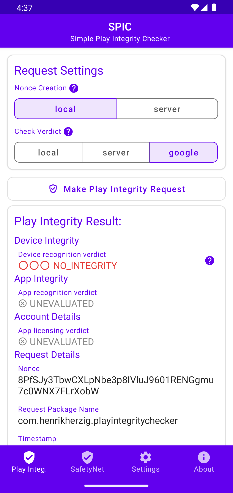
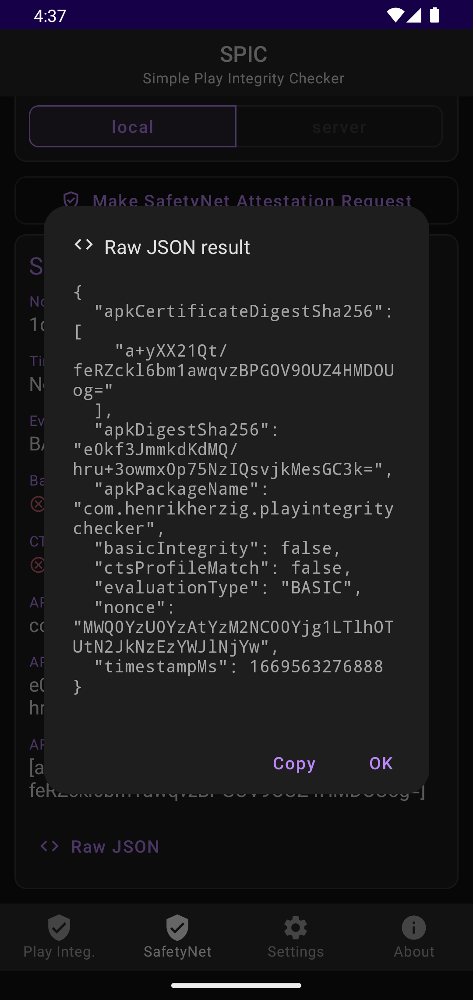
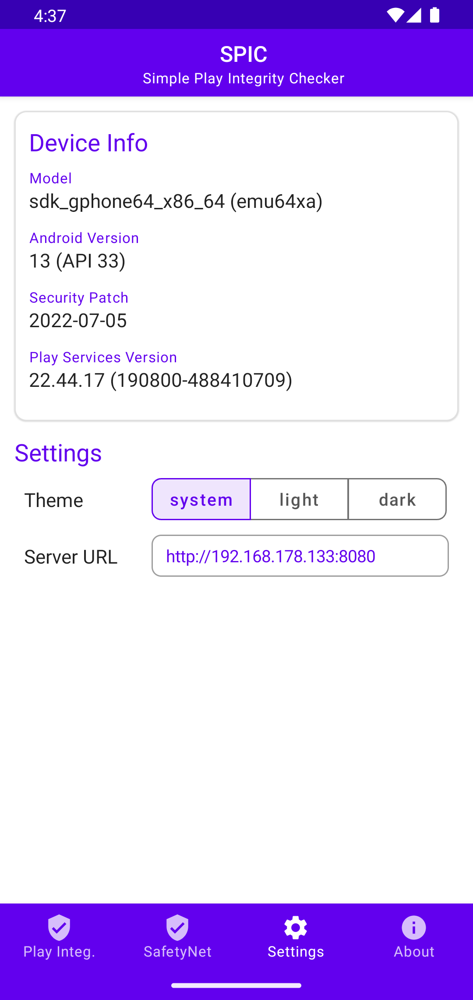
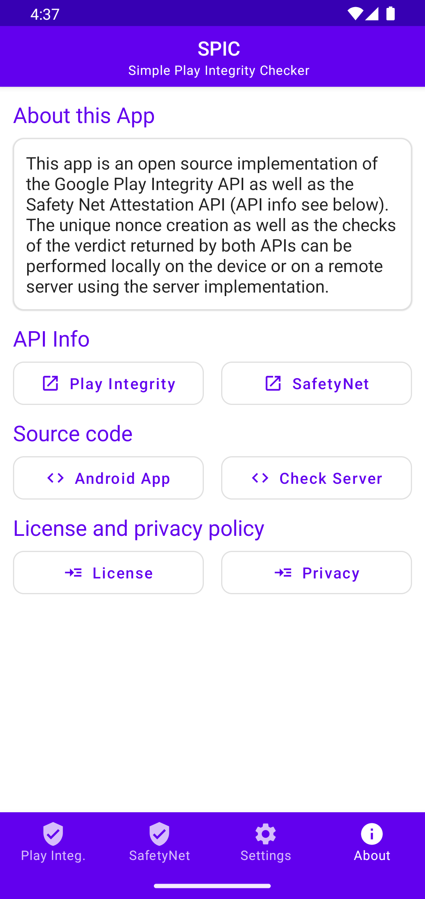

# SPIC - Simple Play Integrity Checker
SPIC (short for **S**imple **P**lay **I**ntegrity **C**hecker) is a simple Android App that demonstrates the usage of the [PlayIntegrity API](https://developer.android.com/google/play/integrity) as well as the deprecated [SafetyNet Attestation API](https://developer.android.com/training/safetynet/attestation).

[](https://play.google.com/store/apps/details?id=com.henrikherzig.playintegritychecker)


# Usage
The app sends a request to the Play Integrity API or SafetyNet Attestation API verifies the request locally on the Android Device or on a remote Server using the [Server Implementation](https://github.com/herzhenr/spic-server) (URL can be defined in settings) and shows the result of the verdict to the user. The Raw JSON result can also be viewed and copied to the clipboard.

Before calling the API to do the attestation a nonce has to be generated which can happen on the device locally (only recommended for testing purposes) or on the server implementation (recommended for production). When using the PlayIntegrity API the verdict check can also be toggled between google and server. The only difference is when using the server the response encryption keys are managed locally on the server and the decryption of the verdict takes place here whereas when using the google option they are managed by google directly and the verdict is decrypted there.

On the settings page a url to reach the Server Implementation can be set. Toggeling between System/Light/Dark mode of the app can be done here as well. The about page contains some more resources about the used APIs as well as the App itself.

# Disclaimer
If you plan on using the Play Integrity / SafetyNet Attestation API in your own app, you should propably use a encrypted connection between the server and the client. Local checks on the Android Devices shouldn't be implemented either. Ideally you should pair this API with another authentication method. Be warned: This implementation is just a proof of concept!

# Screenshots

Play Integrity Request            |  supports Dark Mode
:-------------------------:|:-------------------------:
  |   

Settings Page             |  About Page
:-------------------------:|:-------------------------:
  | 

# Download

- [Google Play](https://play.google.com/store/apps/details?id=com.henrikherzig.playintegritychecker)
- [GitHub Releases](https://github.com/herzhenr/spic-android/releases)

# Build

- build the app using AndroidStudio or the `gradlew :app:aR` command
- if the server functionality is desired, refer to the documentation of the [Server Implementation](https://github.com/herzhenr/spic-server) to set things like environment variables

Some sepcific notes to use the SafetyNet and PlayIntegrity API:

## SafetyNet:
- Obtain an API Key for the SafetyNet Attestation API from Google follwing the [official documentation](https://developer.android.com/training/safetynet/attestation#obtain-api-key)
- add it to to `local.properties` as `api_key=...`

## PlayIntegrity:
- in order to decrypt the integrity verdict locally on the device or the server you have to manage the corresponding decryption and verification keys by yourself. This is only possible if you have a paid Google Developer Account and registered the app bundle in the [Google Play Console](https://play.google.com/console/about/). Navigate to **Release** -> **Setup** -> **AppIntegrity** -> **Response encryption**, click on **Change** and choose **Manage and download my response encryption keys**. Follow the instructions to create a private-public key pair in order to download the encrypted keys.
- add the keys to `local.properties` as `base64_of_encoded_decryption_key=...` and `base64_of_encoded_verification_key=...`

Final local.properties file should look like this:
```
sdk.dir = YOUR SDK PATH
api_key = YOUR KEY
base64_of_encoded_decryption_key = YOUR DECRYPTION KEY
base64_of_encoded_verification_key = YOUR VERIFICATION KEY
```

# Architecture
The app is being developed with the help of Jetpack Compose and makes use of the material 2 design components of google. The following APIs are used:
- SafetyNet Attestation API 
- Play Integrity API
# Credits
Some parts of the app are inspired and contain code of the [YASNAC](https://github.com/RikkaW/YASNAC) app implementation of the SafetyNet Attestation API by RikkaW. Especially the UI of the verdict result are inspired from this app.
Some other parts of the server implementation (google request for playIntegrity decrypt) are inspired by the app [Play Integrity API Checker](https://github.com/1nikolas/play-integrity-checker-app) by 1nikolas. 


# License
MIT License

```
Copyright (c) 2023 Henrik Herzig

Permission is hereby granted, free of charge, to any person obtaining a copy
of this software and associated documentation files (the "Software"), to deal
in the Software without restriction, including without limitation the rights
to use, copy, modify, merge, publish, distribute, sublicense, and/or sell
copies of the Software, and to permit persons to whom the Software is
furnished to do so, subject to the following conditions:

The above copyright notice and this permission notice shall be included in all
copies or substantial portions of the Software.

THE SOFTWARE IS PROVIDED "AS IS", WITHOUT WARRANTY OF ANY KIND, EXPRESS OR
IMPLIED, INCLUDING BUT NOT LIMITED TO THE WARRANTIES OF MERCHANTABILITY,
FITNESS FOR A PARTICULAR PURPOSE AND NONINFRINGEMENT. IN NO EVENT SHALL THE
AUTHORS OR COPYRIGHT HOLDERS BE LIABLE FOR ANY CLAIM, DAMAGES OR OTHER
LIABILITY, WHETHER IN AN ACTION OF CONTRACT, TORT OR OTHERWISE, ARISING FROM,
OUT OF OR IN CONNECTION WITH THE SOFTWARE OR THE USE OR OTHER DEALINGS IN THE
SOFTWARE.
```